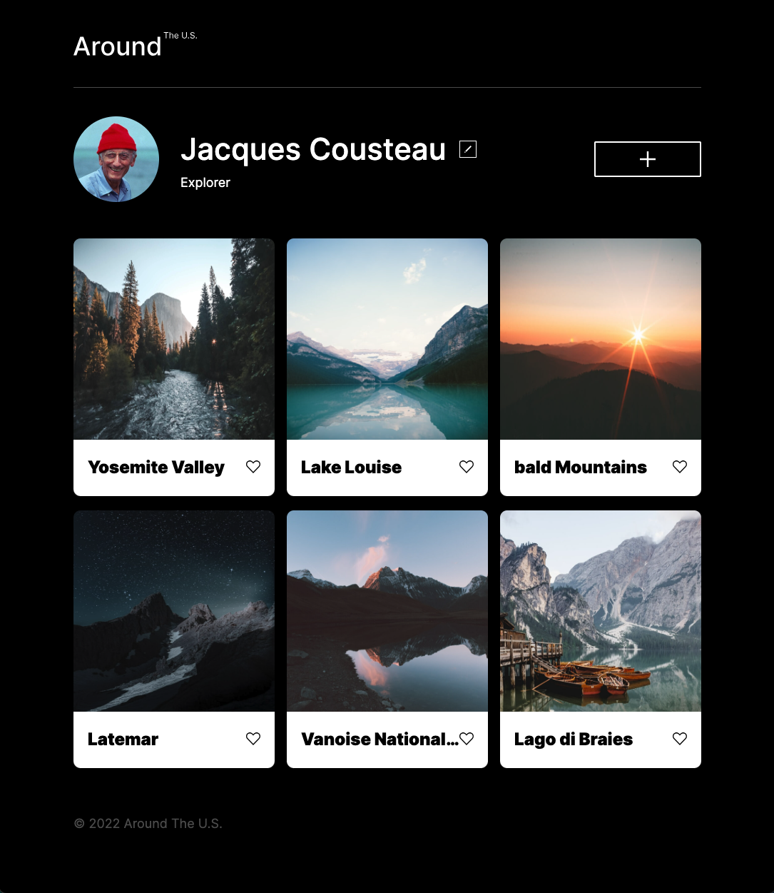

# Around the U.S

This is the third project of the Software Engineering program at TripleTen. It was created using HTML and CSS, based on a design brief.

The project:
https://orzina.github.io/se_project_aroundtheus/

## Project features

- Semantic HTML5
- Flexbox
- Grid
- Positioning
- Flat BEM file structure
- Responsive and adaptive layouts

## Plan on improving the project

Making this project interactive using Java Script.
